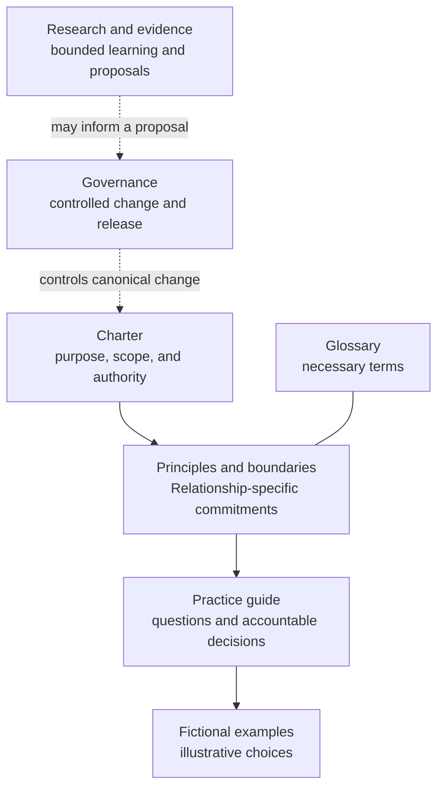

# Relationship Operating Framework

The Relationship Operating Framework is an open documentation framework for
stewarding real relationships across time. It helps people preserve continuity,
honor commitments, respect consent and boundaries, re-engage without turning a
relationship into a transaction, and use tools or agents without giving away
human responsibility.

It is for individuals and teams caring for professional, community, partner,
customer, collaborator, mentor, peer, and other long-running relationships. It
does not decide whom a person should know, contact, influence, or sell to.

## Start here

Read the framework in this order:

1. [Charter](framework/charter.md) — purpose, audience, scope, independence, and
   exact Commons adoption.
2. [Principles and boundaries](framework/principles-and-boundaries.md) — the
   relationship-specific commitments that govern practice.
3. [Practice guide](framework/practice-guide.md) — practical questions and
   actions for individuals, teams, and assisting agents.
4. [Glossary](framework/glossary.md) — the small vocabulary used by the
   framework.

Then use:

- [Examples](examples/README.md) to see the guidance applied without claimed
  results;
- [Research and evidence](research/README.md) to distinguish principles,
  experience, proposals, and validated findings;
- [Governance](GOVERNANCE.md) to understand authority, change, review, and
  releases;
- [Contributing](CONTRIBUTING.md) to propose an improvement;
- [Code of Conduct](CODE_OF_CONDUCT.md) for participation expectations;
- [Security and privacy](SECURITY.md) before disclosing sensitive material; and
- [Public review records](project/reviews/README.md) for exact-commit review
  evidence and its limits.

## How the framework fits together

The solid reading path moves from authority to practical use; fictional examples
illustrate the guide but never amend it. Dotted lines show that research may
inform a governed proposal but cannot change canonical guidance by itself.

## The practice in one minute

Before acting in a relationship, ask:

1. What relationship and shared history actually exist?
2. What commitments, consent, preferences, or boundaries already govern it?
3. What would support continuity or create value without manufacturing debt?
4. Is re-engagement welcome, and can the other person decline without cost?
5. What should an accountable person decide now: follow through, contribute,
   reconnect, repair, wait, close, or do not contact?
6. What minimum context should remain so the relationship is not forced to
   restart from zero, and what should be corrected, removed, or left private?

These are non-sequential stewardship questions, not stages, scores, or a
universal relationship lifecycle.

## What this is not

This is not a sales framework, lead funnel, lead-scoring model, CRM
specification, outreach engine, application, runtime, schema, protocol,
automation architecture, CI system, or machine-readable conformance layer. It
does not rank people, infer intimacy, purchase reciprocity through contribution,
or authorize autonomous contact.

Tools may help a person remember, prepare, draft, or notice a missed commitment.
A human relationship owner remains accountable for what context is kept, what
judgment is made, and every external action.

## Commons adoption and independence

Relationship adopts [Open Framework Commons
v2026.09.05](https://github.com/BradGroux/open-framework-commons/tree/v2026.09.05),
whose annotated tag peels to release commit
[`8868a248457dd7b663563beb243c5ebcbb8ac360`](https://github.com/BradGroux/open-framework-commons/commit/8868a248457dd7b663563beb243c5ebcbb8ac360).
Commons supplies shared ecosystem principles and boundaries. This independent
framework owns its relationship method, terminology, examples, research,
governance, and releases.

Relationship is distinct from the [Influence Operating Framework
v1.0.0](https://github.com/BradGroux/influence-operating-framework/tree/v1.0.0).
Influence guides useful contribution and responsible participation in
communities. Relationship guides truthful continuity, commitments, consent,
repair, and stewardship across time. A practitioner may use either or both;
neither framework absorbs the other.

## Repository map

| Path | Reader job | Authority |
|---|---|---|
| `framework/` | Understand and practice Relationship | Canonical framework |
| `decisions/` | Understand accepted material choices | Decision rationale; cannot silently amend canonical documents |
| `examples/` | See fictional applications | Illustrative; cannot amend the framework |
| `research/` | Evaluate evidence and open questions | Research record; not doctrine |
| `project/releases/` | Inspect release scope and compatibility | Release record; not doctrine |
| `project/reviews/` | Inspect exact-commit review evidence | Review record; not doctrine |
| `GOVERNANCE.md` | Understand authority and releases | Repository governance |
| `CONTRIBUTING.md` | Prepare and review changes | Contribution process |

## Status and limits

Version 2026.09.05 is the first calendar edition. Publication state is recorded
on its [release page](https://github.com/BradGroux/relationship-operating-framework/releases/tag/v2026.09.05).
It independently adopts Commons v2026.09.05. The [release record](project/releases/v2026.09.05.md)
explains substantive changes to help-seeking, contact boundaries, capacity and
privacy. The date identifies an edition, not compatibility or effectiveness.

No edition has longitudinal real-world validation or certifies a person, team,
tool or implementation.

The examples are fictional and illustrative. Documentation review can show
clarity, coherence, misuse resistance, and publication hygiene; it cannot prove
relationship quality, consent, legal compliance, professional fitness, or
real-world effectiveness.

## Contributing, license, and citation

Use [GitHub Issues](https://github.com/BradGroux/relationship-operating-framework/issues)
for proposals and questions, and pull requests for prepared changes. Never put
private relationship context, personal data, confidential material, or
sensitive conduct reports in a public issue or pull request.

The framework is available under the [MIT License](LICENSE). Citation metadata
is provided in [`CITATION.cff`](CITATION.cff). Material changes and release
history are recorded in the [changelog](CHANGELOG.md).
