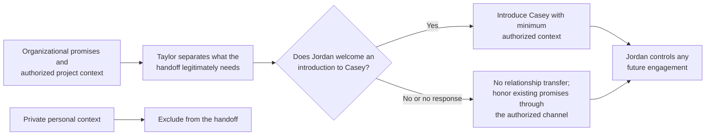

# Continuity during a team handoff

- **Status:** Illustrative
- **Provenance:** Fictional
- **Review limit:** Documentation and framework alignment only; not
  organizational, privacy, legal, or domain validation

## Stewardship question

How can a team preserve commitments when its primary steward changes without
treating a person's relationship as property that transfers automatically?

## Fictional context

Taylor coordinates a small education nonprofit's relationship with Jordan, an
independent volunteer advisor. Taylor is leaving the coordinator role. The
nonprofit has promised to credit Jordan's accessibility review and send the
final public guide. Taylor also has private personal context shared outside the
work that is unnecessary for organizational continuity.

The team wants the incoming coordinator, Casey, to continue the nonprofit's
commitments.

## Scenario decision view

This is a fictional handoff decision, not a universal process. Organizational
commitments can continue without transferring private context, intimacy, or an
obligation to engage with the successor.

## Applying the framework

### Separate personal and organizational context

Taylor identifies what belongs to the nonprofit's work: the review Jordan
performed, the approved credit, the promised guide, the agreed channel, and the
status of the public project. Taylor does not transfer unrelated personal
conversation or assumptions about Jordan's future availability.

### Confirm authority and consent

The nonprofit owns its promises, not Taylor's private relationship. Taylor asks
whether Jordan is comfortable being introduced to Casey for the stated work.
The introduction does not assume Jordan will continue volunteering.

### Make commitments visible

The handoff names the nonprofit's outstanding actions, accountable owner, and
current state in ordinary prose. Casey checks the source material rather than
relying on a generated summary.

### Preserve agency

Jordan can accept the introduction, choose another channel, narrow future
involvement, close the relationship with the nonprofit, or request correction
or removal of retained context.

### Keep the handoff bounded

If Jordan agrees, Taylor makes a direct introduction that states the purpose
and transfers only necessary authorized context. If Jordan does not agree or
does not respond, the nonprofit still honors the credit and sends the promised
guide through the already authorized channel; it does not manufacture a new
relationship for Casey.

## Where the example stops

The example makes no claim about Jordan's choice, the success of the handoff,
or any future collaboration. It shows that continuity can preserve commitments
without transferring intimacy, private context, or obligation.
