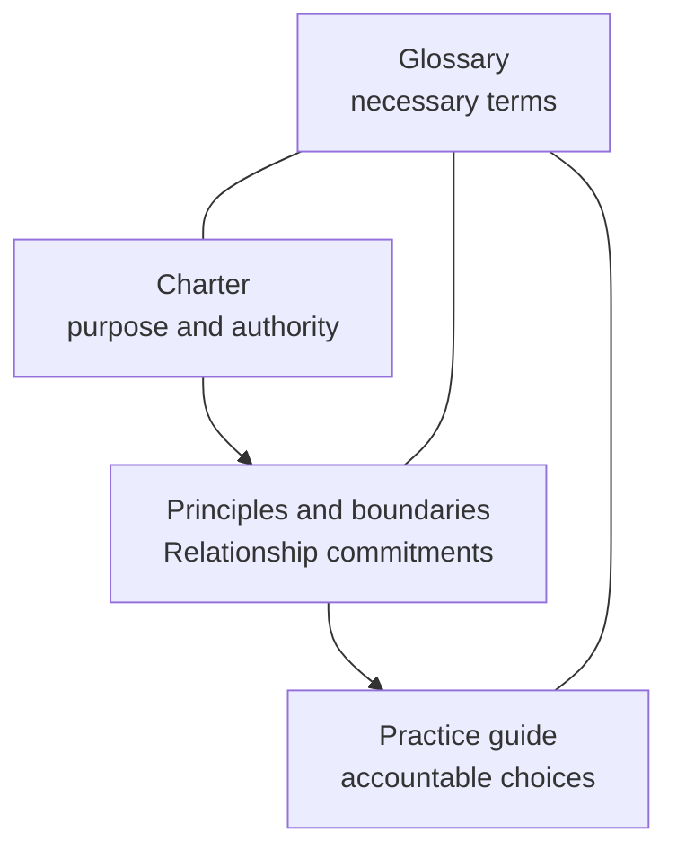

# Framework

This directory contains the canonical Relationship Operating Framework.

## Reading order

1. [Charter](charter.md) - purpose, scope, commitments, authority, and exact
   Commons adoption.
2. [Principles and boundaries](principles-and-boundaries.md) - the
   relationship-specific commitments that govern practice.
3. [Practice guide](practice-guide.md) - practical questions and accountable
   choices for people, teams, and bounded assisting agents.
4. [Glossary](glossary.md) - the framework's necessary terms.

The charter bounds the framework. Principles and boundaries state what the
practice must preserve. The practice guide helps people apply those commitments
without creating stages, scores, systems, or autonomous authority. The glossary
supports all three without adding requirements.

[Examples](../examples/README.md) illustrate the guidance but cannot amend it.
Research, decisions, release records, tools, and reviews serve their stated
repository jobs and are not canonical framework content.
