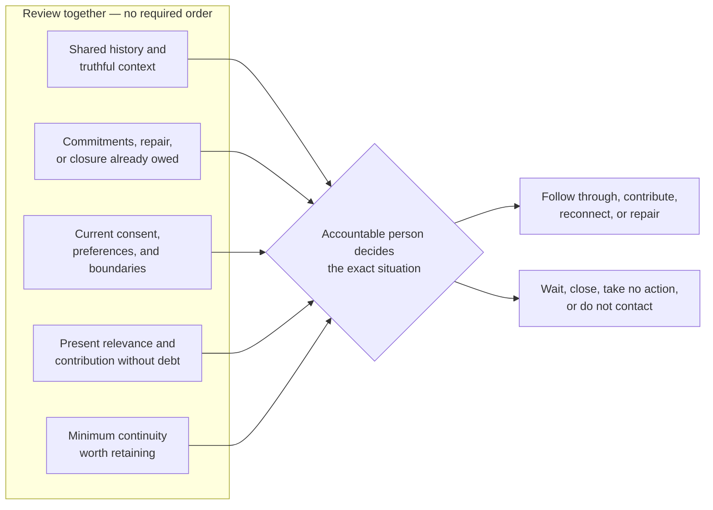
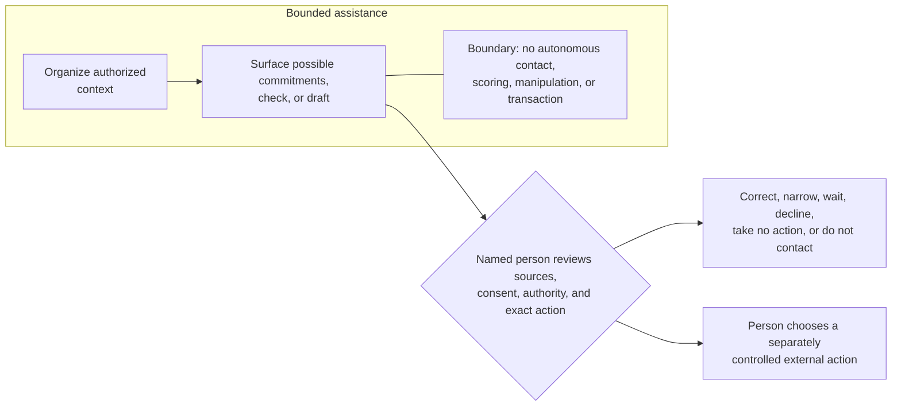
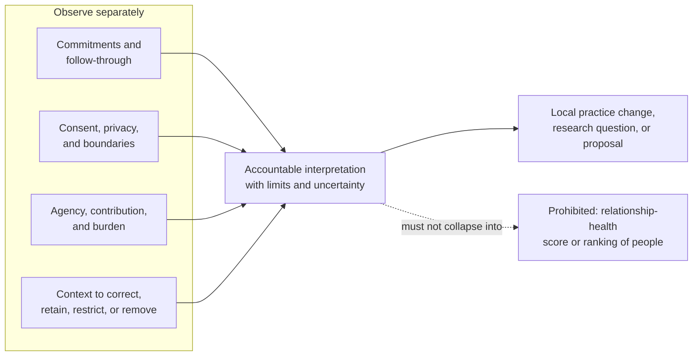

# Practice guide

This guide helps a person, team, or bounded assisting agent apply the framework
to a real stewardship decision. It is deliberately tool-independent and
non-sequential. Use the questions that fit the situation, revisit them when
circumstances change, and stop when action would exceed consent, authority, or
available context.

## Start small

Begin with one real relationship and one current stewardship question, such as:

- What promise needs follow-through?
- Is a quiet relationship appropriate to re-engage?
- What context must survive a team handoff?
- Is repair needed before anything new is requested?
- Should a boundary, correction, closure, or do-not-contact decision be carried
  forward?

Do not begin by importing an entire address book, enriching profiles, assigning
scores, or automating contact. A list of people is not a relationship practice.

## The minimum stewardship check

The check can be completed in ordinary prose. It is not a form, required record,
workflow, or lifecycle.

| Question | Look for | Stop or narrow when |
|---|---|---|
| What relationship actually exists? | Direct shared context, current roles, what is known versus assumed | Closeness or relevance depends on inference, scraped data, or stale context |
| What is already owed? | Promises, follow-ups, introductions, corrections, unresolved harm, explicit endings | A new ask would bypass an existing commitment or needed repair |
| What is welcome? | Current consent, channel preference, subject boundaries, privacy, do-not-contact signals | Permission is absent, withdrawn, ambiguous, or limited to another context |
| What matters now? | The other person's expressed needs, changed circumstances, mutual purpose, capacity | The only reason to act is activity, visibility, quota, fear, or predicted value |
| What can be contributed without debt? | Useful help, clear intent, manageable burden, no required reciprocity | The contribution disguises a pitch, creates unwanted work, or purchases access |
| What should a person decide? | Follow through, contribute, reconnect, repair, wait, close, no action, do not contact | No accountable human has authority or time to review the exact action |
| What continuity should remain? | Minimum context needed for a promise, boundary, handoff, or future understanding | Retention is excessive, unsafe, unauthorized, disputed, or has no stewardship need |

Completion means the accountable person can make a responsible decision. It
does not require contact, a response, a meeting, a score, or a measurable
commercial outcome.

The questions converge on human judgment rather than a score or automated next
step. Either action or restraint can be responsible.

## Preserve truthful continuity

When continuity is needed:

1. Keep the shared context that another accountable steward would genuinely
   need.
2. Separate direct facts, the other person's own statements, and the steward's
   interpretation.
3. Make uncertainty and age visible instead of presenting old context as
   current.
4. Carry commitments and boundaries across tools or team handoffs.
5. Correct or remove context when its subject disputes it, permission changes,
   or the stewardship need ends.

A short authorized note can be enough. The framework does not require fields,
statuses, a timeline, or one source of truth. The appropriate location,
retention period, and access controls depend on the relationship and the
governing organization, community, and law.

## Honor commitments

Before creating a new commitment:

- identify existing promises made by the person or team;
- confirm what was actually promised rather than trusting a generated summary;
- name the human owner, realistic next step, and any changed capacity;
- tell the affected person early when a promise cannot be kept;
- renegotiate or close it instead of letting it silently disappear; and
- preserve enough context for another authorized steward to follow through.

An internal reminder is useful only if it leads to accountable human judgment.
It is not evidence that the commitment was understood, completed, or accepted.

## Re-engage without transacting

Re-engagement is appropriate only when the shared context is real, the purpose
is honest, and the contact respects current permission and relevance.

A responsible re-engagement:

- identifies the sender plainly;
- uses only genuine shared context;
- explains why the person is reaching out now;
- leads with a relevant contribution or honest desire to reconnect, not a
  concealed ask;
- makes no claim of intimacy the relationship does not support;
- gives the recipient room to decline, redirect, or not respond; and
- does not trigger an automated chase sequence after silence.

If a commercial interest is material, name it before the recipient makes a
decision affected by it. A warm tone does not make a commercial ask
non-transactional; clarity and freedom from pressure do.

## Repair or close

When a commitment was missed or harm may have occurred:

1. Confirm the facts and affected people without broadening access to sensitive
   context.
2. Pause new asks and promotional activity.
3. Name what happened without manufacturing certainty or minimizing impact.
4. Take responsibility within the steward's actual authority.
5. Offer a proportionate correction or repair without demanding engagement,
   forgiveness, or restoration.
6. Honor any resulting boundary, including no response, closure, or do not
   contact.
7. Improve the steward's practice without turning the other person into a case
   study.

Safety, safeguarding, legal, employment, or other high-impact matters may
require designated authorities and private processes. This framework does not
replace them.

## Share stewardship across a team

Team stewardship exists to preserve continuity, not to distribute private
knowledge as widely as possible.

- Name a human steward for each consequential commitment or external action.
- Share only context that recipients are authorized to receive and need for the
  handoff.
- Introduce a successor when appropriate instead of silently transferring the
  relationship.
- Preserve the other person's ability to choose whom they engage with.
- Make organizational commitments explicit; do not imply that a departing
  person's private relationship automatically belongs to the organization.
- Carry forward corrections, consent changes, and do-not-contact decisions so a
  different teammate or tool does not restart unwanted contact.

## Use agents as assistants

An agent may help only within a scope established by an accountable person and
the systems, policies, consent, and access controls that govern the context.

| Agents may assist with | Agents must not do |
|---|---|
| Organizing authorized context for human review | Scrape or enrich people because information is available |
| Surfacing possible commitments, contradictions, or stale facts | Treat an inference or confidence score as relationship truth |
| Drafting a private checklist or a message for exact human approval | Decide whom to contact, when to contact them, or through which channel |
| Checking a proposed action against known consent and boundaries | Send, schedule, queue, or retry external contact autonomously |
| Preparing a handoff using approved minimum context | Spread private context beyond authorized recipients |
| Recording the human's approved decision and source | Promise, negotiate, purchase, sell, or transact on a person's behalf |
| Prompting periodic human review of retained context | Rank people, predict their value, or manipulate attention and emotion |

Approval must apply to the exact external action. A general instruction, batch
button, lack of objection, or past approval does not authorize a new recipient,
message, commitment, or transaction.

Assistance ends at preparation. A person retains the contact decision,
commitment authority, and any separately controlled external action.

## Reflect without claiming proof

After a material interaction or restraint decision, ask:

- Were existing commitments honored or renegotiated honestly?
- Were consent, privacy, and communication boundaries respected?
- Did the action create value without manufacturing debt?
- Did both people retain agency, including the ability not to continue?
- What context should be corrected, retained, restricted, or removed?
- What should the steward repeat, change, or research next?

Record an observation as experience, not universal proof. Follow the [research
and evidence guidance](../research/README.md) before promoting a lesson into
framework doctrine.

Learning improves the steward's practice. It does not convert another person's
response, reach, role, or commercial value into a measure of human worth.

## Proposals, not current requirements

The initial release intentionally leaves these questions open:

- **First user:** no founder, executive, community steward, account team, or
  individual adopter has been selected as the canonical first user.
- **First job:** re-engagement, continuity, commitment recovery, and handoff are
  useful candidate entry points; none is the required first job.
- **Lifecycle:** the framework has no relationship stages, maturity ladder, or
  universal sequence.
- **Domain model:** the framework defines no entities, fields, statuses, event
  types, record formats, or scoring rules.
- **Mission Control:** a future proposal may explore what an adopter needs to
  see to make stewardship decisions. No dashboard, view, metric, design system,
  or implementation is part of the current framework.

These ideas may be tested through research and issues. An implementation may
make local choices, but it must not present them as framework requirements.
