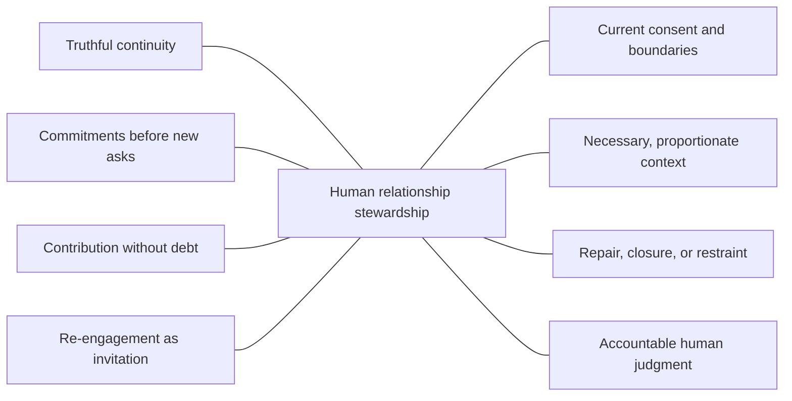

# Principles and boundaries

The [charter](charter.md) adopts the shared philosophy in [Open Framework
Commons v1.0.0](https://github.com/BradGroux/open-framework-commons/tree/v1.0.0).
This document states the product-local principles needed to practice
relationship stewardship. It explains Relationship; it does not restate or
replace Commons.

## Stewardship view

These connected concerns describe what responsible stewardship keeps in view.
They are not stages, scores, database entities, or a required lifecycle. Their
meaning comes from the principles below.

## People are not representations

A person is not their profile, contact record, role, message history, inferred
interests, or potential value. Treat all such material as incomplete context
that may be stale, wrong, private, or unnecessary.

Do not infer closeness from shared attendance, employment, follows, likes,
introductions, or data proximity. Describe only the relationship and permission
that actually exist.

## Continuity matters more than activity

Stewardship is not a contact cadence. A healthy relationship may involve long
quiet periods, a changed role, an explicit ending, or no next action.

Continuity means the people involved are not forced to reconstruct important
shared context, commitments, boundaries, and decisions each time. It does not
mean preserving every interaction or maintaining constant contact.

## Commitments come before new asks

Before requesting time, attention, access, endorsement, work, or an
introduction, check what has already been promised or left unresolved. Follow
through, renegotiate, apologize, repair, or close the commitment before adding a
new one.

A tool may surface a possible commitment. A person must confirm its meaning,
owner, current state, and appropriate next step.

## Contribution creates no debt

Offer useful help because it serves a real person, shared purpose, or community,
not because it purchases future access. State material interests when they
could change how an offer is understood.

The recipient controls whether the contribution is wanted and whether anything
follows. No contribution creates a right to a reply, meeting, referral,
endorsement, sale, or relationship.

## Re-engagement is an invitation

Time does not erase a relationship, but past familiarity does not guarantee
present access. Re-engagement should name genuine shared context without
exaggerating closeness, make its purpose clear, and allow an easy no or no
response.

Do not hide a pitch inside a check-in. Do not turn silence into a sequence of
automated retries. When permission or relevance is uncertain, wait, use a more
appropriate channel, or do not contact.

## Consent is current and specific

Consent to one conversation, channel, subject, introduction, event, or use of
information does not automatically apply to another. Communication preferences
and do-not-contact decisions are controlled by the affected person and honored
across the team and any assisting tools.

Consent can change. Stewardship includes noticing withdrawal, correcting shared
understanding, and preventing a stale copy from restoring an expired permission.

## Keep only necessary context

Preserve enough authorized context to honor commitments, avoid harmful
repetition, and support a responsible handoff. Do not collect information merely
because it is available or might become useful.

Separate observed facts from interpretation. Record source and uncertainty when
they matter. Correct or remove stale, disputed, excessive, or improperly held
context. Keep sensitive material private and access-limited.

## Repair and closure are stewardship

Missed commitments, misunderstandings, changed capacity, and harm should not be
hidden to preserve the appearance of a healthy relationship. Name what happened
proportionately, listen, take responsibility within legitimate authority, and
make repair without demanding forgiveness.

Sometimes the responsible outcome is a changed boundary, an explicit ending,
no action, or do not contact. Closure does not make the relationship a failure.

## Humans own relationship judgment

A relationship owner is a named person accountable for stewardship; the term
does not imply ownership of another person. Teams may share work, and agents may
assist with authorized preparation, but a human decides what context is
appropriate, whether contact is warranted, what commitment may be made, and
what external action occurs.

Batch approval, a confidence score, a model recommendation, a workflow state,
or silence from a reviewer does not transfer that responsibility.

## Learn without scoring people

Learning asks whether commitments were honored, boundaries respected, context
handled carefully, repair attempted appropriately, and both parties retained
agency. It does not compute a universal relationship-health score or rank people
by access, role, response, reach, revenue, or predicted value.

Evidence should improve the steward's own practice. It must not become a covert
judgment of another person's worth, loyalty, responsiveness, or usefulness.

## Tools remain replaceable

People may use memory, notes, calendars, documents, CRMs, task systems, or agents
when those tools fit their context and authority. The practice must remain
usable in plain language without any of them.

An implementation can add local controls or workflows. It cannot redefine the
framework or turn an optional technical choice into a universal requirement.
